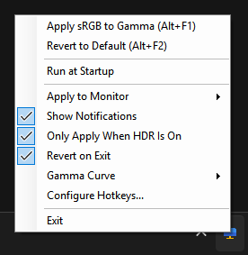

# HDR Gamma Fix

A Windows system tray utility to fix gamma issues with SDR content when using HDR displays with comprehensive multi-monitor support.

## Overview

Windows HDR implementation often causes SDR content to appear washed out due to incorrect gamma handling. This utility provides a simple way to toggle between default Windows color management and a corrected gamma profile for a better viewing experience.

This tool is designed to stay in your system tray, allowing you to quickly switch profiles with keyboard shortcuts or by clicking the tray icon.

  

**Based on:** [win11hdr-srgb-to-gamma2.2-icm](https://github.com/dylanraga/win11hdr-srgb-to-gamma2.2-icm) by dylanraga. This project provides a convenient interface for applying the color calibration approach described in that repository.

### Gamma Curve
The correction curve (LUT) depends on the **SDR content brightness** slider in Windows HDR settings. By default the app generates the curve itself, per monitor, from that slider's current value, using the same formula as dylanraga's [LUT generator](https://dylanraga.github.io/gen-srgb-to-gamma-lut/). Moving the slider regenerates and reapplies it automatically, so there is no file to edit.

Under **Gamma Curve** in the tray menu you can change the gamma (2.2 or 2.4), raise the black floor if dark detail is crushed, and override the GPU method (NVIDIA or AMD, detected automatically). If you prefer a hand-made curve, choose **Use lut.cal File** and replace `scripts/lut.cal` with the generator's output. The bundled `lut.cal` is the generator's output for 300 nits (slider 55), gamma 2.2, NVIDIA method, and a hand-edited `lut.cal` is kept in use automatically after upgrading.

## Features

### Core Functionality
- **Quick Toggle:** Single left-click the tray icon to switch between default and gamma-corrected profiles
- **Keyboard Shortcuts:**
  - Alt+F1: Apply sRGB to Gamma profile
  - Alt+F2: Revert to Default profile
- **Minimal Footprint:** Lightweight system tray application that uses minimal resources
- **Visual Feedback:** Different icons for each profile state and brief notifications

### Multi-Monitor Support
- **Automatic Monitor Detection:** Detects all available monitors using dispwin.exe
- **Selective Application:** Choose to apply profiles to specific monitors or all monitors
- **Monitor-Specific Control:** Apply different profiles to different monitors as needed
- **Smart Menu Display:** Context menu shows all available monitors with clear labels

### User Experience
- **Notification Control:** Toggle balloon notifications on/off while retaining all functionality
- **Startup Management:** Configure the application to run automatically at Windows startup
- **Settings Persistence:** All preferences (monitor selection, notification settings) are saved and restored
- **Visual Status:** Tray icon tooltip shows current profile and selected monitor(s)
- **Automatic Recovery:** Detects when Windows resets the gamma ramp (Display Settings, sign-in, unlock, resume from sleep) and reapplies the profile
- **HDR Awareness:** Only applies the profile to displays with HDR on, and restores displays when HDR is switched off (can be disabled)

### Menu Options
- Apply sRGB to Gamma (configurable hotkey, default Alt+F1)
- Revert to Default (configurable hotkey, default Alt+F2)
- Configure Hotkeys... (change the global hotkeys)
- Run at Startup (toggleable)
- Apply to Monitor (submenu with all detected monitors)
  - All Monitors (applies to every detected monitor)
  - Individual monitor selection (Monitor 1, Monitor 2, etc.)
- Show Notifications (toggleable)
- Only Apply When HDR Is On (toggleable, on by default)
- Gamma Curve (current SDR brightness per monitor; automatic curve or lut.cal file; gamma, black floor, GPU method)
- Revert on Exit (toggleable, off by default)

## Requirements

- Windows 10/11 with HDR capability
- [.NET 9 Desktop Runtime (x64)](https://dotnet.microsoft.com/download/dotnet/9.0) — required for the framework-dependent release

## Installation

1. Download the latest release from the [Releases](../../releases) page
2. Extract the files to a location of your choice (ensure all files stay together)
3. Run HDRGammaFix.exe
4. Optionally, enable "Run at Startup" from the context menu

### Required Files for Distribution
When moving or sharing the application, ensure these files stay together:
- HDRGammaFix.exe
- scripts/dispwin.exe
- scripts/lut.cal
- Resources/DefaultIcon.ico
- Resources/GammaIcon.ico

`HDRGammaFix.pdb` (debug symbols) is optional and only needed when diagnosing crashes.

> The `.bat` files in `scripts/` are kept for reference/documentation only; the app invokes `dispwin.exe` directly.

## Usage

### Basic Operation
- **Left-click** the tray icon to toggle between profiles
- Use **Alt+F1** (configurable) to apply the gamma-corrected profile
- Use **Alt+F2** (configurable) to revert to the default Windows profile
- Change hotkeys via **Configure Hotkeys...** in the right-click menu
- **Right-click** for additional options and settings

### Multi-Monitor Setup
1. Right-click the tray icon to open the context menu
2. Navigate to "Apply to Monitor" submenu
3. Select either:
   - **All Monitors**: Applies the profile to every detected monitor
   - **Individual Monitor**: Choose a specific monitor (e.g., Monitor 1, Monitor 2)
4. The selected option is remembered between application restarts

### Notifications
- Toggle balloon notifications on/off via "Show Notifications" in the context menu
- When enabled, you'll see brief notifications when profiles are applied
- When disabled, the application works silently while maintaining all functionality

## Troubleshooting

### Monitor Detection Issues
- Ensure dispwin.exe is in the scripts folder
- Try restarting the application to refresh monitor detection
- Check that all monitors are properly connected and recognized by Windows

### Profile Not Applied
- Verify all required files are present in the application folder
- Ensure HDR is enabled in Windows Display Settings for the target monitor (with "Only Apply When HDR Is On" checked, displays in SDR mode are skipped)
- Try applying to individual monitors if "All Monitors" isn't working

### Settings Location
All preferences (monitor selection, notifications, hotkeys, run at startup) are stored under
`HKEY_CURRENT_USER\SOFTWARE\HDRGammaFix` and can be reset by deleting that key. Automatically
generated curves are written to `%LOCALAPPDATA%\HDRGammaFix\luts`.

## License

MIT License - See [LICENSE](LICENSE) file for details.

## Acknowledgements

- Based on the research and color profile work by [Dylan Raga](https://github.com/dylanraga)
- Icons adapted from standard system resources for clarity

## Third-Party Notices

- `scripts/dispwin.exe` is part of [Argyll CMS](https://github.com/argyllcms/argyllcms) v3.1.0 by Graeme W. Gill, licensed under the [GNU Affero General Public License v3](https://www.gnu.org/licenses/agpl-3.0.html). This project bundles it unmodified; you may obtain the corresponding source from the upstream repository. The full license text is available in `AGPL-3.0.txt`.
